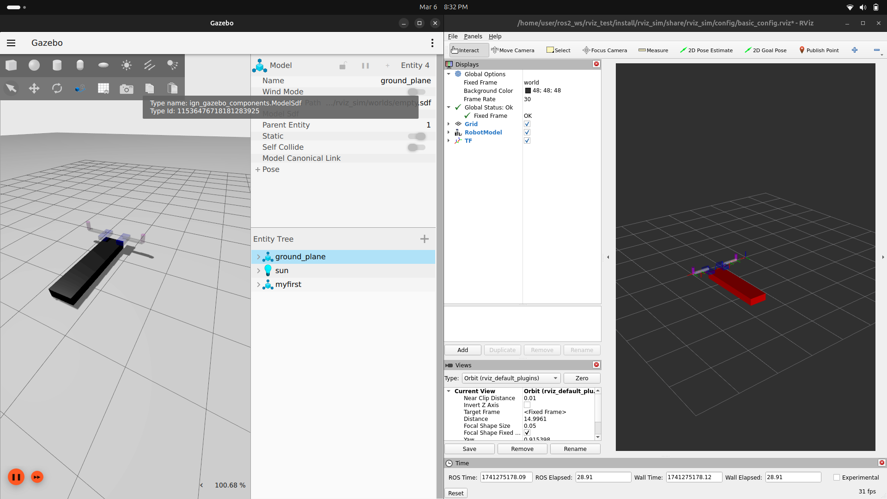

# Manupilator Robot

To run with Gazebo and Rviz: `ros2 launch rviz_sim gazebo_model_launch.py`



## Only Slider Joints being controlled
```bash
ros2 topic pub /wing_position_controller/commands std_msgs/msg/Float64MultiArray "data: 
- 0.5
- 1.0"
# right_wing_position
# left_wing_position
``` 
[](https://youtu.be/UFW8E3utMZs)
## Only Slider Joints being controlled
```bash
ros2 topic pub /rotating_wing_position_controller/commands std_msgs/msg/Float64MultiArray "data: 
- 0.5
- 0.25
- 1.0
- 0.5"
# right wing position
# right outter wing rotation
# left wing position
# left outter wing rotation
``` 
[](https://youtu.be/9ZYsF8hs3Fg)
